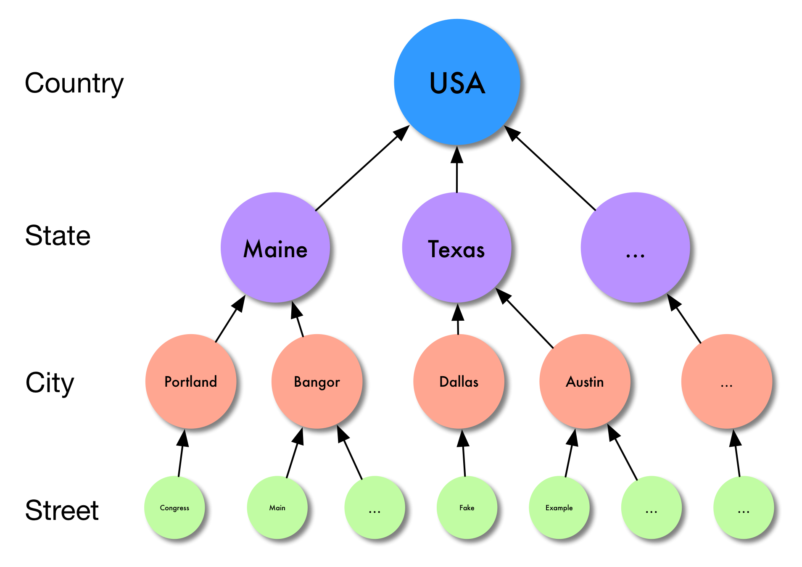
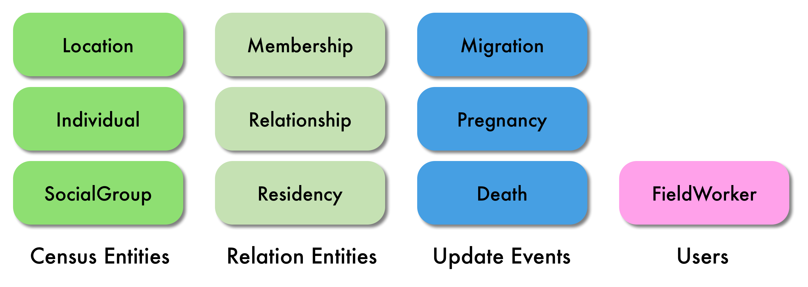
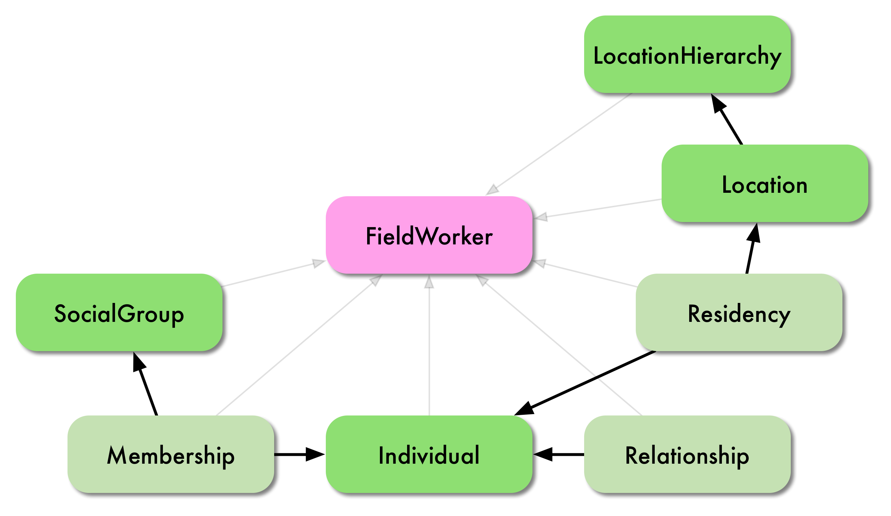
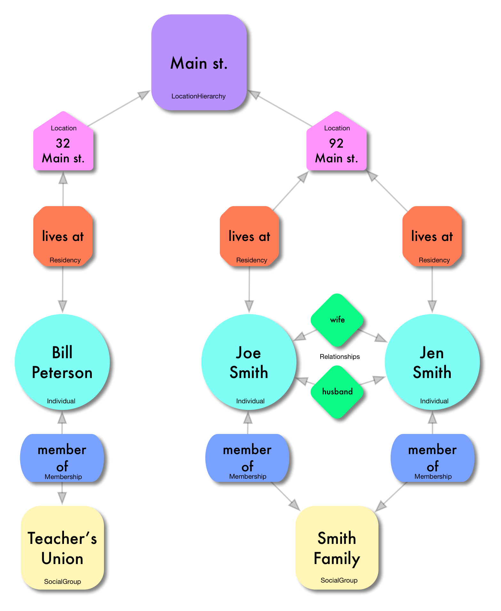
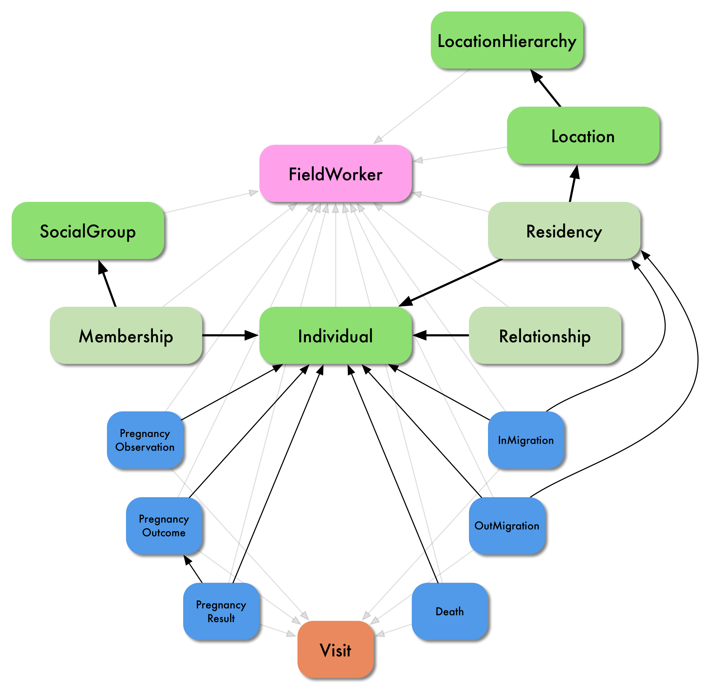

#What is the OpenHDS? 

######It is the Open Health and Demographic System. It provides an intuitive and easy way to record populations and their changes over time. The OpenHDS logically breaks down the geography of an area of study and captures the major demographic events within it.

##The OpenHDS view of the world:
####The Hierarchy

The first thing to understand is the way the OpenHDS represents the area of study for a project.
For every geographical location on Earth there exists some way to represent that location hierarchically, much like is done when writing a letter to someone. In general, an address starts from the most specific description of the location and slowly become more general until the location you’re sending the letter to is well enough understood by the postal service. 

The OpenHDS has a similar view of the world.

The regions, districts, prefectures, cities, etc that comprise the area of study are each represented
in the OpenHDS by an entity called **LocationHierarchy**. There is one *Root* LocationHierarchy that represents
the largest geographical denomination for the area of study. Underneath the *Root* is a LocationHierarchy for every other geographical denomination, each of which points to their ‘parent’ which forms a tree-like structure that represents the entire area of study. The easiest way to understand this is with a picture using a real world example…

#####The United States as modeled by LocationHierachy.    

*figure 1*

This is a simplified example. It’s obvious that there is not enough space on this page to list out all 50 states and all cities and streets for each state, but it perfectly demonstrates the aforementioned tree.

####Everything Else

Now that the study area is broken down logically into a hierarchy within the OpenHDS the demographic data has a geographical context. Every piece of information within the OpenHDS is tied in some way to the hierarchy, just as a population and its changes over time are tied to their geographical location. 

The information in the OpenHDS comes in 3 main flavors. *Census* data: people, the places they live and the groups they belong to. *Relation* data: information about how people are related to one another, members of groups, or resident at a location. *Update* data: records of events that change the census data over time.

#####A simplified overview of the OpenHDS entities and events.

*figure 2*

The **Census Entities** are Location, Individual, and SocialGroup.

+ **Locations** are particular points of interest within the study area. Locations are the leaf nodes on the hierarchy described above, there is nothing below them because they are most atomic geographical denomination. Examples of Locations could be buildings and houses. 
 
+ **Individuals** are the people within the area of study, i.e. the population. Since the OpenHDS is primarily focused on demographic information, many of the other entities and events within the system are dependent on individuals.

+ **SocialGroups** are the societal or cultural organizations that the people in the area of study are a part of. Examples of SocialGroups are church groups, families, book clubs, etc.

The **Relation Entities** are Membership, Relationship, and Residency. 

+ **Memberships** are what tie an Individual and a SocialGroup together; a Membership is made for every SocialGroup a person a part of. An example of a Membership is being a member of a particular family. 

+ **Relationships** are what tie two Individuals together; a Relationship can be made for each way an individual is related to anyone else. An example of a Relationship is being the son of someone, being the pastor of someone, or being someone’s lawyer.

+ **Residencies** are what tie Locations and Individuals together; a Residency is made for each Location an Individual is a resident at. An example of a Residency is being a resident at your house (a Location) and perhaps your parent’s house (A different Location).

Without explaining the Update Events yet, a picture is starting to form on how the Census and Relation Entities are oriented with respect to one another. To give things more context, however, it is necessary to explain the FieldWorker entity. The OpenHDS is a system that relies on data being collected in an area of study. To help keep track of who collected what and when, the FieldWorker is needed. All of the entities in *figure 2* are collected either directly or indirectly by a FieldWorker and thus all are dependent on the FieldWorker. Without Update Events, here is a look at how things are dependent on each other…

#####How things fit together (with no Update Events).

*figure 3*

This image makes it easier to visualize how things fit together, but maybe an example would be more helpful…

#####A real-world example.

*figure 4*

There are three Individuals: Bill Peterson, Joe Smith, and Jen Smith. 

Bill has a Residency at the Location 32 Main st, his home. 

Bill also has a Membership for the SocialGroup ‘Teacher’s Union’.

Bill’s house, the Location 32 Main st, is a child of the LocationHierarchy Main St. 

It is easy to imagine that this Main St. could be the same one branching off of the City of Bangor in Figure 1, which would make Bill a resident of the State of Maine, USA. 

On this same street, but at a different Location, lives Joe and Jen Smith. 

The Smiths are a family, so they both have a Membership for the SocialGroup ‘Smith Family’. 

The Smiths also share a Relationship each, one from each person’s point of view: Jen is Joe’s wife, and Joe is Jen’s husband. 

It is easy to imagine a FieldWorker walking down Main St. and knocking on Bill Peterson’s door and surveying him and then continuing up the street to the Smith Family’s door and collecting all this information.

#### The Update Events.
    
Collecting information about the who and what within an area of study is powerful, but no population is static, things change over time. The OpenHDS provides functionality to capture these changes via a well defined set of what it calls *Update Event* entities. Specifically, the OpenHDS is concerned with the coming and going of Individuals to and from the area of study. In general this is only possible by one of the three ways shown in Figure 1: an Individual migrates in or out of the area of study, an Individual is born into the area of study, or an Individual dies while in the area of study. The OpenHDS models these three events in more detail than what is shown in the diagrams and is explained below.

+ An **InMigration** is the migration of an Individual into the area of study. This can come in two flavors: Internal or External. 

 - An Internal InMigration is when an Individual migrates from one place within the study area to another place still in the study area. 

 - An External InMigration is when an Individual comes from outside of the area of study and migrates to a location within it. 

+ An **OutMigration** is the migration of an Individual to outside of the area of study. 
 
Examples of migrations in general would be an individual who accepts a new job outside of the area of study and moves to be closer to it, an individual marries another individual and moves from one place to another within the study area, etc.

+ Pregnancies are complex multi-stage events in the real world and so in the OpenHDS are modeled differently than the other Update Events. A pregnancy has three discrete event entities: **PregnancyObservation**, **PregnancyOutcome**, **PregnancyResult**. 
 
 - A PregnancyObservation is the initial record of the pregnancy by a FieldWorker. 

 - The PregnancyOutcome is a record of what the outcome of the pregnancy was, this includes information about actual delivery date and the number and type of births the pregnancy yielded. 
 
 - Finally, the PregnancyResult is a record for each birth from a particular PregnancyOutcome.

+ Lastly, a **Death** is the death of an individual and the last way an individual can leave an area of study.

Just as with the Census and Relation entities, all of these entities are collected by and dependent on a FieldWorker entity. However, these Update events are inherently different than the census information: they’re time dependent. The census data is time independent demographic and geographic information collected from the study area. However, as time moves forward the population that the census data was initially gathered from will slowly change as people come, go, are born, or die. In order to capture this data the same population must be visited periodically so that the Update events can be accounted for within the OpenHDS. This act of visiting the population is modeled explicitly within the OpenHDS with an entity called a **Visit**. All of the Update event entities are dependent on a Visit. However, a FieldWorker can resurvey a group within the study area and create a visit, but find that nothing has changed thus leaving the visit empty.

#####Expanding on Figure 3, here is the full picture…

*figure 5*

TODO: 
+ "real world" example of the update events.
+ Make a pass through the documentation below and fix a lot of mistakes

